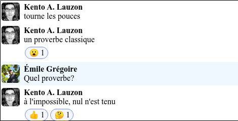

# Slack-poetry

When instant messaging reads like poetry.

A static site generator to export and publish IM conversations. The goal of this project is to render conversations in a way that mimics the original medium, while supporting rich message formatting.

# How to use

1. Create a `content` directory at the project root.
2. Place a JSON dump of the conversations in the `content` directory.
   ( TODO publish Slack extraction scripts + document payload format.)
3. Build your static site!

```bash
npm install
npx gatsby build
```

4. Serve the `public` folder containing your static site using any HTTP server. E.g. `python -m http.server`.

# Example

# Credits
Built using GatsbyJS, using the default starter template. https://github.com/gatsbyjs/gatsby-starter-default.
